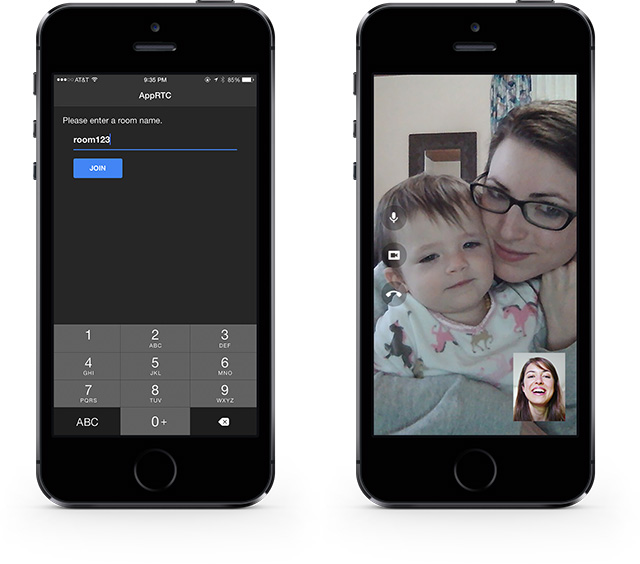

# AppRTC - iOS implementation of the Google WebRTC Demo

## About
This Xcode project is a native wrapper for the Google's WebRTC Demo. It organizes the WebRTC components into a cocoa pod that can be easily deployed into any Xcode project. The precompiled libWebRTC static library bundled with the pod works with 64-bit apps, unlike prior versions of WebRTC projects where only the 32-bit version was available. Currently, the project is designed to run on iOS Devices (iOS Simulator is not supported).

Included in this Xcode project is a native Storyboard based Room Locator and Video Chat View Controllers:



## Features
* Fully native objective-c 64-bit support
* pre-compiled libWebRTC.a (saves you hours of compiling)
* Cocoa Pod 
* View Controllers to easily drop into your own project
* Exposed APIs to easily customize and adapt to your needs (see below for more details)
* Supports the most recent https://apprtc.appspot.com (March 2015)
* We also have a fork of the [Google AppRTC Web Server](https://github.com/ISBX/apprtc-server) that maintains full compatibility with this project

## Notes
The following resources were useful in helping get this project to where it is today:
* [How to get started with WebRTC and iOS without wasting 10 hours of your life](http://ninjanetic.com/how-to-get-started-with-webrtc-and-ios-without-wasting-10-hours-of-your-life/)
* [hiroeorz's AppRTCDemo Project](https://github.com/hiroeorz/AppRTCDemo)

## Running the AppRTC App on your iOS Device
To run the app on your iPhone or iPad you can fork this repository and open the `AppRTC.xcworkspace` in Xcode and compile onto your iOS Device to check it out. By default the server address is set to https://apprtc.appspot.com.

## Using the AppRTC Pod in your App
If you'd like to incorporate WebRTC Video Chat into your own application, you can install the AppRTC pod:
```
pod install AppRTC
```
From there you can look at the `ARTCVideoChatViewController` class in this repo. The following steps below detail the specific changes you will need to make in your app to add Video Chat.
#### Initialize SSL Peer Connection
WebRTC can communicate securely over SSL. This is required if you want to test over https://apprtc.appspot.com. You'll need to modify your `AppDelegate.m` class with the following:

1. Import the RTCPeerConnectionFactory.h
 ```
#import "RTCPeerConnectionFactory.h"
```

2. Add the following to your `application:didFinishLaunchingWithOptions:` method:
 ```objective-c
    [RTCPeerConnectionFactory initializeSSL];
```

3. Add the following to your `applicationWillTerminate:` method:
 ```objective-c
    [RTCPeerConnectionFactory deinitializeSSL];
```

#### Add Video Chat
To add video chat to your app you will need 2 views:
* Local Video View - Where the video is rendered from your device camera
* Remote Video View - where the video is rendered for the remote camera

To do this, perform the following:

1. In your ViewController or whatever class you are using that contains the 2 views defined above add the following headers imports:
 ```objective-c
#import <AppRTC/RTCEAGLVideoView.h>
#import <AppRTC/ARDAppClient.h>
```

2. The class should implement the `ARDAppClientDelegate` and `RTCEAGLVideoViewDelegate` protocols:
 ```objective-c
@interface ARTCVideoChatViewController : UIViewController <ARDAppClientDelegate, RTCEAGLVideoViewDelegate>
```
    * `ARDAppClientDelegate` - Handles events when remote client connects and disconnect states. Also, handles events when local and remote video feeds are received.
    * `RTCEAGLVideoViewDelegate` - Handles event for determining the video frame size.
    
3. Define the following properties in your class:
 ```objective-c
@property (strong, nonatomic) ARDAppClient *client;
@property (strong, nonatomic) IBOutlet RTCEAGLVideoView *remoteView;
@property (strong, nonatomic) IBOutlet RTCEAGLVideoView *localView;
@property (strong, nonatomic) RTCVideoTrack *localVideoTrack;
@property (strong, nonatomic) RTCVideoTrack *remoteVideoTrack;
```
    * *ARDAppClient* - Performs the connection to the AppRTC Server and joins the chat room
    * *remoteView* - Renders the Remote Video in the view
    * *localView* - Renders the Local Video in the view
    
4. When initializing the the property variables make sure to set the delegates:
 ```objective-c
    /* Initializes the ARDAppClient with the delegate assignment */
    self.client = [[ARDAppClient alloc] initWithDelegate:self];
    
    /* RTCEAGLVideoViewDelegate provides notifications on video frame dimensions */
    [self.remoteView setDelegate:self];
    [self.localView setDelegate:self];
```

5. Connect to a Video Chat Room
 ```objective-c
    [self.client setServerHostUrl:@"https://apprtc.appspot.com"];
    [self.client connectToRoomWithId:@"room123" options:nil];
```

6. Handle the delegate methods for `ARDAppClientDelegate`
 ```objective-c
- (void)appClient:(ARDAppClient *)client didChangeState:(ARDAppClientState)state {
    switch (state) {
        case kARDAppClientStateConnected:
            NSLog(@"Client connected.");
            break;
        case kARDAppClientStateConnecting:
            NSLog(@"Client connecting.");
            break;
        case kARDAppClientStateDisconnected:
            NSLog(@"Client disconnected.");
            [self remoteDisconnected];
            break;
    }
}

- (void)appClient:(ARDAppClient *)client didReceiveLocalVideoTrack:(RTCVideoTrack *)localVideoTrack {
    self.localVideoTrack = localVideoTrack;
    [self.localVideoTrack addRenderer:self.localView];
}

- (void)appClient:(ARDAppClient *)client didReceiveRemoteVideoTrack:(RTCVideoTrack *)remoteVideoTrack {
    self.remoteVideoTrack = remoteVideoTrack;
    [self.remoteVideoTrack addRenderer:self.remoteView];
}

- (void)appClient:(ARDAppClient *)client didError:(NSError *)error {
    /* Handle the error */
}
```

7. Handle the delegate callbacks for `RTCEAGLVideoViewDelegate`
 ```objective-c
- (void)videoView:(RTCEAGLVideoView *)videoView didChangeVideoSize:(CGSize)size {
 /* resize self.localView or self.remoteView based on the size returned */
}
```


## Contributing
If you'd like to contribute, please fork the repository and issue pull requests. If you have any special requests and want to collaborate, please contact me directly. Thanks!

## Known Issues
The following are known issues that are being worked and should be released shortly:
* Audio Mute needs to be implemented
* Video Mute needs to be implemented
